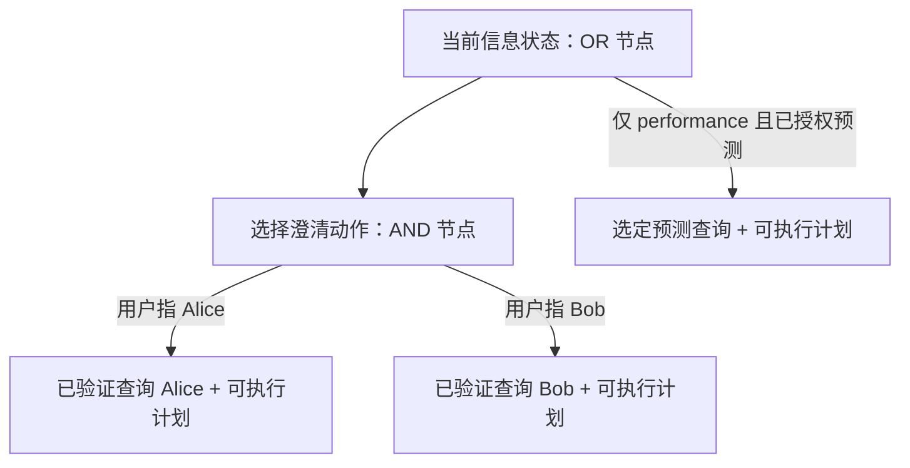

# XGAP 当前规划方案与实施顺序

2026-09-14，用户已批准实施，并明确要求 finite-depth AND/OR tree、strong plan、
优先出可行计划和实际表现，不声明全局最优。本文是中文入口；[技术契约](decisions/practical_strong_planning_v1.md)
与[实现报告](report/practical_strong_planning_20260914.md)分别记录算法和验证事实。

## 计划到底是什么

XGAP 的外层计划是一个有条件的策略：现在执行哪个信息动作，得到不同观察后分别
怎么办，最后执行哪个完整查询。内层物理计划负责同一查询如何在真实图源上执行。

选择澄清动作，需要先保证两个声明结果都有完整后续，才是 strong plan。实际澄清
只发生一次，实际数据库也只执行被观察结果对应的最终计划。不会为了选优先把
Alice/Bob 两个查询都执行。若还声明了“不知道”结果，就必须为它找到可行后续；
没有后续时不能偷偷删除这条分支。

## 两种模式的当前承诺

|项目|EXACT|PERFORMANCE：度量待定义阶段|
|---|---|---|
|查询骨架|可信、版本化、有界|相同|
|指定语义槽位|全部有验证记录|只有授权的槽位允许预测|
|硬约束、已验证绑定|保持|保持|
|信息获取|为满足验证条件执行必要动作|可在已有信息下提前执行|
|最终执行|一个完整物理计划|对选定预测查询执行一个完整计划|
|语义偏差数值保证|不把验证等同于任意 NL 正确率|尚无；输出 null / metric_deferred|
|成本最优性|不声称全局最优|不声称全局最优|

d(Q_tilde,Q_star) 由用户下一理论阶段推进。当前不自行定义替代度量，不把 confidence、
候选个数或 LIMIT 行数当 epsilon 保证。新模式暂不继承旧的关系截断功能；它仍作为
独立、带原有局限的历史实现保留。以后若启用，必须有明确的近似语义与误差契约。

## 如何优先保证能出 plan

1. 先构造一个满足语义和资源条件的基础物理计划，不等待全部优化完成。
2. 缺少验证时，按成本顺序尝试可完成全部声明结果的有限深策略。
3. 一旦形成可行 strong plan，保留为当前方案。
4. 剩余预算用于改进；估计器不可用、优化域超限或搜索期限到达，都不能抹掉已有方案。
5. 无法满足原始语义或没有后端能力时说明实际缺口；不伪造计划或把失败叫成功。

第一版采用“先可行、按成本顺序完成分支、限额改进”的搜索，不冒称全局 AO* 最优。
数学对象依然是有限深 AND/OR 树的 strong solution subgraph。有限深不等于多项式；
实现同时限制全局状态/动作/结果数量，并复用非笛卡尔积的物理候选生成。

## 工程顺序与完成标准

|里程碑|内容|当前证据/完成标准|
|---|---|---|
|P-S1|strong-plan 协调器、权威验证、可行基础计划、GoalLoop 执行、普通入口|已实现；22 项新检查通过，普通模板 NL 与实际进程内 SPARQL 链路通过|
|P-S2|冻结 catalog/能力查询/可选 LLM 动作的统一适配，以及真实 Neo4j+Fuseki 小图门|有界开发门已完成；14+3适配检查与后续8+3同请求检查；同请求live槽位提议→strong→双后端成功，1模型372token/1计划/2源调用/gold一致|
|P-S3|降低实际数据读取和总延迟|逐跳候选6项新小图检查通过；真实native组件4行gold不变，源行62→51；14响应可回放；速度/排序优势仍待评价|
|P-S4|用户定义的偏差度量接入与论文配置冻结|等待度量；其余工程不因此停滞。之后讨论实验计划的模式/信息条件修订|

[P-S2 完整证据与局限](report/practical_information_native_20260914.md)。
[P-S3 本地组件门与冻结估计器排序](report/progressive_binding_20260914.md)。
[真实逐跳与live信息组件补充](report/progressive_native_and_live_tools_20260914.md)。
[同请求live信息与双后端证据](report/practical_model_e2e_20260914.md)补齐了可信模板下的一槽
模型动作整体链路；不是开放NL结构验证、两模式性能优势或论文总体结果。
原来的真实 native/FinBench 结果继续按旧版本报告，不能追溯作为新 strong planner 的证据。

统一开发配置与普通请求记录入口现已通过14项新检查+2项受影响检查，支持发布、预检、
单次执行与严格成功/失败回放；见[配置报告](report/practical_profile_20260914.md)。
旧权重不变，tiny统计离线更新；0新网络，不等于论文模式release或新native结果。
成本/排序的[同会话六步诊断](report/practical_cost_diagnostic_20260914.md)已完成：三计划均
正确，第二序列coordinator145ms、fanout169ms、progressive174ms，冻结排序在本例一致。
[相同完整源读取共享](report/shared_native_reads_20260914.md)也已通过11项新检查和一次
真实strong请求，4行gold保持，实际调用14→11。[必要源过滤](report/source_row_prefilters_20260914.md)
也通过14+2本地检查和真实门，源行64→61，4行gold不变；Cypher类型另有1调用组件证据。
[请求准备](report/practical_preparation_20260915.md)已实现每请求冻结bundle加载4→1。
[共同worker](report/practical_worker_20260915.md)已通过本地/回放门；
[合作式预算](report/cooperative_planning_budget_20260915.md)保留可行计划，停止到期的可选工作。
[共同native门](report/practical_worker_native_20260915.md)现已通过一次真实EXACT请求，
4行gold、11源调用，外层1711ms，所有资源关闭。下一步核对新strong契约与旧18图协议，形成输入权限/方法/计量和release缺口清单，
供后续讨论；不自动启动大图或消融，不改变批准的数据优先级及baseline。不调估计分数，不重复前轮六步或大题。
动作顺序与费用按[新契约](decisions/acquisition_order_v1.md)分开；
未知费用保持null，不为展示LLM链路假设昂贵澄清。9月15日02:00收尾总结，10:00恢复。

最新接线审计见[系统完成范围与18图修订草案](research_contract_audit_20260915.md)。
可信模板核心与共同native成功门已通；新strong方法尚未进入旧campaign，论文版本的
输入权限/模式配置仍需单独发布。该草案不改变已批准的数据优先级或启动新评价。

## 实验应证明什么

信息成本占主导的查询：关注获取信息次数、首次可行计划时间、总规划时间、总在线
时间和意图/答案质量。执行占主导的查询：关注源行数、bytes、调用数、执行时间和
完整答案。两者分开解释，再报告整体效果，不用人为昂贵的澄清成本制造胜出。

旧 FinBench 的约21ms规划、约2.7s解释、约27–30s执行说明：仅缩小搜索预算不足以
大幅改善这些大图请求。新理论解决信息决策，执行策略仍需解决后续跳完整读取。

研发只用 toy 和失败 replay。保持原有 18 图计划及数据集优先级，不提前启动大量消融。
baseline 忠实运行，不修改算法或修补答案。澄清带来的额外语义信息单独报告；共同
解析查询上的物理对照与获得澄清帮助的端到端对照不能混成同一种优势。
