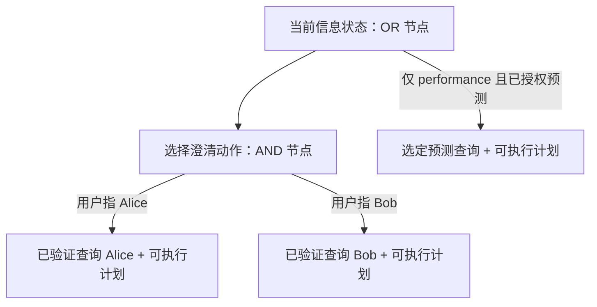

# XGAP 当前规划方案与实施顺序

2026-09-14，用户已批准实施，并明确要求 finite-depth AND/OR tree、strong plan、
优先出可行计划和实际表现，不声明全局最优。本文是中文入口；[技术契约](decisions/practical_strong_planning_v1.md)
与[实现报告](report/practical_strong_planning_20260914.md)分别记录算法和验证事实。

## 计划到底是什么

XGAP 的外层计划是一个有条件的策略：现在执行哪个信息动作，得到不同观察后分别
怎么办，最后执行哪个完整查询。内层物理计划负责同一查询如何在真实图源上执行。

选择澄清动作，需要先保证两个声明结果都有完整后续，才是 strong plan。实际澄清
只发生一次，实际数据库也只执行被观察结果对应的最终计划。不会为了选优先把
Alice/Bob 两个查询都执行。若还声明了“不知道”结果，就必须为它找到可行后续；
没有后续时不能偷偷删除这条分支。

## 两种模式的当前承诺

|项目|EXACT|PERFORMANCE：度量待定义阶段|
|---|---|---|
|查询骨架|可信、版本化、有界|相同|
|指定语义槽位|全部有验证记录|只有授权的槽位允许预测|
|硬约束、已验证绑定|保持|保持|
|信息获取|为满足验证条件执行必要动作|可在已有信息下提前执行|
|最终执行|一个完整物理计划|对选定预测查询执行一个完整计划|
|语义偏差数值保证|不把验证等同于任意 NL 正确率|尚无；输出 null / metric_deferred|
|成本最优性|不声称全局最优|不声称全局最优|

d(Q_tilde,Q_star) 由用户下一理论阶段推进。当前不自行定义替代度量，不把 confidence、
候选个数或 LIMIT 行数当 epsilon 保证。新模式暂不继承旧的关系截断功能；它仍作为
独立、带原有局限的历史实现保留。以后若启用，必须有明确的近似语义与误差契约。

## 如何优先保证能出 plan

1. 先构造一个满足语义和资源条件的基础物理计划，不等待全部优化完成。
2. 缺少验证时，按成本顺序尝试可完成全部声明结果的有限深策略。
3. 一旦形成可行 strong plan，保留为当前方案。
4. 剩余预算用于改进；估计器不可用、优化域超限或搜索期限到达，都不能抹掉已有方案。
5. 无法满足原始语义或没有后端能力时说明实际缺口；不伪造计划或把失败叫成功。

第一版采用“先可行、按成本顺序完成分支、限额改进”的搜索，不冒称全局 AO* 最优。
数学对象依然是有限深 AND/OR 树的 strong solution subgraph。有限深不等于多项式；
实现同时限制全局状态/动作/结果数量，并复用非笛卡尔积的物理候选生成。

## 工程范围与当前验收

2026-09-15：冻结5d82b6f的首轮真实评价已完成，384/384终态/评分、全部托管服务关闭。
用户最新要求先验收和讨论，自动唤醒已暂停，不自动执行候选改动。整体Goal未完成。

|环节|已有实现/证据|本轮结论|
|---|---|---|
|P-S1 strong核心|全策略seed完成后再优化，声明AND结果完整、可行方案保留|192次XGAP执行均strong、1最终计划，无当前题probe/fit/retry|
|P-S2 信息与真实链|catalog/可选LLM/权威适配、同请求live模型与双后端门|本轮两模式均选择便宜关系权威，模型0调用，不是接口不可用|
|P-S3 执行工作降低|协调器/首跳/逐跳、完整读取共享、必要过滤和准备优化|native/RDF两模式均48/48正确；本轮源调用/bytes逐题相同|
|P-S4 度量与论文契约|可信结构/单关系槽、两模式参数、固定外部前端及独立release已发布|d仍待用户定义；模式机制收益、有效SOTA效率比较和scalability尚未证明|

[本轮结果与验收](report/partial_strong_first_pass_20260915.md)给出完整分母、计时、失败、
模型usage恢复及候选收益依据。[系统与18图审计](research_contract_audit_20260915.md)说明
接下来的讨论范围。新结果不并入旧NL、旧固定计划或不同权限的结果。

原始开发证据：[Strong核心](report/practical_strong_planning_20260914.md)、
[信息适配](report/practical_information_native_20260914.md)、
[同请求live链](report/practical_model_e2e_20260914.md)、
[逐跳诊断](report/practical_cost_diagnostic_20260914.md)、
[读取共享](report/shared_native_reads_20260914.md)、
[必要过滤](report/source_row_prefilters_20260914.md)、
[共同真实worker](report/practical_worker_native_20260915.md)、
[全策略先可行](report/global_strong_seed_20260915.md)。它们各自保持原版本/范围，不重复运行以累加证据。

## 实验应证明什么

信息成本占主导的查询：关注获取信息次数、首次可行计划时间、总规划时间、总在线
时间和意图/答案质量。执行占主导的查询：关注源行数、bytes、调用数、执行时间和
完整答案。两者分开解释，再报告整体效果，不用人为昂贵的澄清成本制造胜出。

本轮native搜索中位数270→90ms，但在线12.832→12.623s；RDF搜索115→35ms，
在线29.319→26.552s，后者差距主要在执行阶段且源工作量未变。不能把全部时间差归因
于planner。下一步是否验证重复读取/估计特征，要先讨论机制与否证门，不自动继续循环。

研发只用 toy 和失败 replay。保持原有 18 图计划及数据集优先级，不提前启动大量消融。
baseline 忠实运行，不修改算法或修补答案。澄清带来的额外语义信息单独报告；共同
解析查询上的物理对照与获得澄清帮助的端到端对照不能混成同一种优势。
