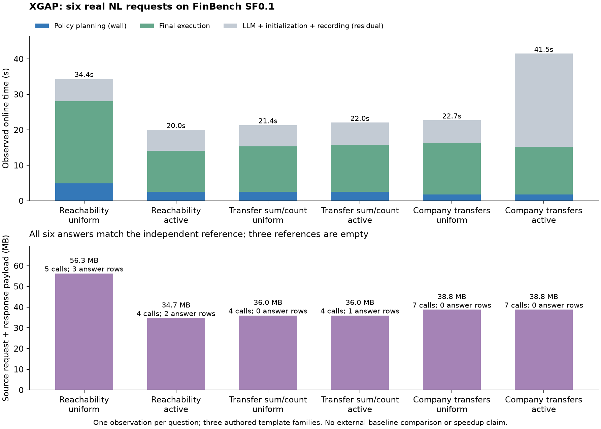

# 第六章首批真实实测与方法更正

2026-09-22。**已取得新版统一 XGAP 在真实 FinBench SF0.1 上的首批端到端结果：
6 道预选问题，6/6 自然语言回答匹配独立参考。** 本批是小样本 pilot，尚无可用的
外部 Two-stage 同部署成绩，不能宣称优于 SOTA，也不是新版三域全量实验。

## 方法口径

按用户最新更正，论文 **Two-stage 是外部方法的实际串接**，LD（LLM-direct）退出。
内部 `xgap-unified-two-stage` 仅保留历史诊断 ID，不能改名冒充外部基线。
已停止旧批次的剩余对照，只补齐原先未尝试的两道 XGAP NL 问题。详见
[方法决定](../decisions/ch6_external_twostage_20260922.md)和
[当前方法注册表](../../experiments/ch6_method_registry_20260922.json)。

外部候选 ARUQULA → FedUP（FedX 执行）仍未通过接口验收：原版前端的 VALUES
探索查询触发所固定 FedUP 的 `OpTable` 不支持错误。原版模型/lookup 的成功不能
代替完整组合成功；原始失败完整保留。ARUQULA → FedX 仅是另一个待验收组合，
尚未运行，不能静默替换后沿用 FedUP 名称。
[ARUQULA 原论文](https://arxiv.org/abs/2510.02200)描述的是迭代探索、执行的方法；
将忠实保留其调用步骤和计量。
[FedUP 作者实现](https://github.com/GDD-Nantes/fedup)支持的执行引擎选择不等于
上述上游查询解析/变换问题已解决。

## 问题、数据与执行边界

- 真实 FinBench v0.1.0 SF0.1 归档，使用已冻结的 Neo4j + Fuseki native 存储，
  55,604 个节点、309,577 条关系；本轮不重建 catalog、不训练估计器。
- 3 个作者构造的模板族：时限路径可达、账户转账聚合、公司所持账户转账聚合。
  每族各一个均匀 ID、一个源图活跃 ID，共 **6 个独立 question–intent case**。
  分层资格只取源图结构，不读取答案、耗时或方法胜负选题。
- 每题 3 个二值未定字段、8 个解释；等权结构化 query discrepancy，epsilon=1/3；
  固定字段和硬约束不放宽。模拟用户持有隐藏意图，在线只通过计费动作披露。
- 每题分别运行公开受控初态和自然语言入口，共 **12 次 XGAP 执行**。
  受控轨道不是新的问题，也不是 NL 端到端结果。NL 使用真实 `qwen3.8-27b` 服务，
  每题一次生成、没有自动修补重试；参考答案由独立 CSV 扫描/DFS 产生。
- 固定 D=2、H=12、K=4；可选搜索每次上限 1500 ms；每题最多一个最终执行计划。
  题间复用成功服务副本；每题仅一次观测，没有重复均值或严格缓存配对加速实验。
- 这 3 个族与开发模板共享，尚非独立模板留出集、LC-QuAD 自动转化结果或 W1–W4
  完整覆盖。无新 metadata/probe 目标，本批不能评价 probe 收益。

## 结果

|指标|受控初态：6 次|真实 NL：6 次|
|---|---:|---:|
|回答并与独立参考完全一致|6/6|6/6|
|平均答案行 multiset F1|1.000|1.000|
|有非空参考的题数|3/6|3/6|
|在线总耗时中位数|17.83 s|22.38 s|
|规划 CPU 中位数|2.50 s|2.52 s|
|最终执行耗时中位数|13.26 s|13.37 s|
|模型调用合计|0|6|
|模型输入／输出 token 合计|0 / 0|20,713 / 2,593|
|后端 HTTP attempt 合计|31|31|
|源请求与响应 payload 合计|240.52 MB|240.52 MB|

中位数按列独立计算，不能相加。在线总耗时包含该题初始化、模型、规划、最终执行和
记录成本，不含离线装载与服务启动。payload 是观测到的应用请求/响应字节，不是网络
协议总流量。采样 worker 峰值约 400–606 MB，不是整个服务组的总内存。

两层都单独保存在 CSV/JSON：NL 均匀层 3/3 正确、总耗时中位数 22.71 s；
活跃层 3/3 正确、22.04 s。活跃资格不保证本题完整条件下答案非空。
6 题参考行数依次为 3、2、0、1、0、0；空结果也按相同独立参考核对。

全部 12 次实测 query discrepancy=0，12 次证书检查无违约。此处证书是已声明有限
解释族上的结构化距离证书，**不是输出答案 F1 的先验保证**。答案质量独立事后评估。
每题一次全字段澄清、披露 3 个未定字段，NL 另有一次范围确认；全部首轮可选搜索
触及时限并使用完成回退。本批没有体现减少澄清的收益，不能据此声称形成非平凡权衡。

上图灰色部分是总耗时减去规划 wall time 和执行时间的剩余量，含模型、初始化和记录，
不能把它全部解释为模型延迟。下图同时标出调用数和答案行数，显示数据移动仍偏大。
[PDF](assets/ch6_first_real_20260922/xgap_first_real.pdf)、
[逐次 CSV](assets/ch6_first_real_20260922/cells.csv)、
[汇总 JSON](assets/ch6_first_real_20260922/summary.json)。

## 修复、失败与证据保留

真实 pilot 首次暴露多个物理父计划经不同改写收敛到相同子计划时，产生重复动作 ID。
修复在完整父计划集合上对相同子池/成本去重，保留确定性的首个有效变换证明；
不改变语义、成本模型或作者基线。定向收敛测试通过，随后完成上述真实执行。
另修复输入发布目录创建及批量中断时的失败收据/资源关闭处理。

保留全部尝试，不覆盖失败：

|批次|结果与边界|
|---|---|
|first-real v1|离线发布目录失败；未调用模型或后端|
|first-real v2|4 个受控 cell 因重复动作失败；0 模型/源查询；关闭资源后停止|
|first-real v3|25 个已封存 cell；按用户更正中止旧对照，未伪装为完成的 30-cell 比较|
|XGAP continuation v1|只执行原先未尝试的 2 个 XGAP NL cell，均成功|

v3 的 25 个封存 cell 中，仅 10 个属于当前 XGAP；其余 11 个内部对照、4 个 LD
排除于当前主结果。更正时另有 1 个 LD cell 被中断，缺少完整用量收据，不能擅自记
模型调用为零，也不能计为回答错误。全部已启动服务组有关闭收据。
当前报告是 10+2 个 XGAP cell，不能把 27 个历史封存执行称为 27 道独立问题。

## 结果对下一步的指向

1. 外部 Two-stage 的忠实接口验收是主比较的前提；外部只支持 RDF 时，必须在同事实、
   同 RDF 部署上比较，不能拿本轮 native 延迟计算相对外部 RDF 的 speedup。
2. 优先分析重复完成检查/叶估计的 CPU 和缓存依赖，在时限内保留已完整评价的可行动作，
   保持所有 outcome 的完成预留。当前每题首轮超时回退，会掩盖联合搜索的潜在收益。
3. 每题只有 0–3 行答案，却传输约 34.7–56.3 MB；检查合法过滤下推、读共享、绑定策略
   的候选可达性和估计排序。只做可证明语义等价的改写，不借当前题试跑选赢家。
4. 此后冻结更多独立模板和跨域映射、可比较部署、调用预算与重复协议，再扩正式矩阵。
   暂不展开大规模消融；不因本批全对就称全量实验已完成。

上述第 2、3 项为后续优化任务，尚未用这次结果证明改进有效。

## 复现

运行源码为 `d0ae7e3dfa757b47df8bd84017721f2d61ddb6d2`；末两题的发布提交为
`8a7d4e3d676ea906b8895b8dc7885a2e91bc4d69`，两者 `src/` 无差异。
[证据索引](../../experiments/artifacts/ch6_first_real_20260922.json)固定归档、发布、
manifest、关闭收据和派生产物的 SHA-256。原始数据、私有意图和模型内容留本地。

`scripts/summarize_ch6_first.py` 只读取已封存证据、核对哈希和关闭收据，输出新目录；
`scripts/plot_ch6_first.py` 只绘制该目录，不触发模型或后端执行。结果 v2 仅增加来源
固定信息、改善绘图，逐次观测值与结果 v1 相同。旧发布器已禁止发布过期比较。
