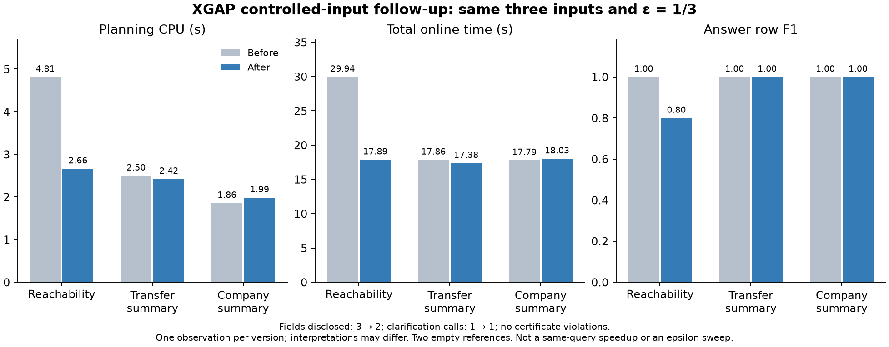

# 统一规划优化与外部 Two-stage 接入进展

2026-09-22。已修复超时后丢失搜索进展和重复计算问题，并完成三题 SF0.1 工程实测。
外部 ARUQULA→FedX 已能执行真实探索查询；完整方法运行因模型动作格式错误结束，
未产生最终答案。**没有把这个失败改成成功，没有调整基线 prompt/算法。**

## Material Passport

|项|内容|
|---|---|
|执行范围|用户已授权的 research prototype 工程、小图接口与已暴露 SF0.1 实例|
|协议|[执行前决定](../decisions/ch6_planner_external_followup_20260922.md)|
|验证级别|已实际执行；单次诊断，不做统计显著性/泛化声明|
|来源|固定 commit、manifest、关闭收据及 SHA-256；[证据索引](../../experiments/artifacts/ch6_planner_external_followup_20260922.json)|
|基线边界|Two-stage 是外部原版组件组合；LD 排除；内部变体不替代 SOTA|

## 工程改动

原控制器在一个后续动作超时时，会丢弃此前已经完整评价的所有根动作，只执行最初的
完成路径。现在只有在根动作的每一个 outcome 都通过完成预留并评分后，才保存这个
选择；预算耗尽时保留已完成的改进选择。未完成的动作不能参与比较，实际执行前仍
重新验证资格与预算。新增超时分支测试检查“后一个动作只评估了一部分，不能抢占
前一个完整选择”，包括全部分支的资源预留。

种子计划身份只计算一次；状态标识、terminal、completion 使用请求内缓存，各最多
128 个状态。缓存键覆盖 bindings/receipts、facts、保留计划池、披露数和固定候选，
不跨请求或快照复用。物理变换、字段权威、epsilon、损失定义、H/D/K 和估计器不变。
相关控制器/物理空间/完整小图 37 个测试通过；外部输入、调用计量、原版 API 外壳的
5 个测试通过；后续仅重测修改的 2 个外壳测试，没有重复整个回归集。

带剖析器的小图诊断中，规划 CPU 从 2.670 s 到 1.237 s，展开状态从 253 到 320，
首轮由超时变为完成。这含剖析器开销，且搜索工作量不同，**不能用作论文加速比**。

## 三题真实 SF0.1 结果

这是上批 3 个模板各自的首个 uniform case，题目、意图、估计器、快照和 epsilon=1/3
均保持原固定值。新执行使用受控初态，**没有重新调用 LLM**；与前轮同题受控记录比较。
每题每版本只有一个观察值，旧版本先前的运行顺序/缓存状态不能视为严格配对。

|指标：旧 → 新|路径可达 00|账户转账聚合 02|公司转账聚合 04|
|---|---:|---:|---:|
|在线总耗时|29.94 → 17.89 s|17.86 → 17.38 s|17.79 → 18.03 s|
|规划 CPU|4.815 → 2.664 s|2.498 → 2.423 s|1.857 → 1.986 s|
|最终执行|22.68 → 12.84 s|12.97 → 12.64 s|13.56 → 13.65 s|
|披露字段|3 → 2|3 → 2|3 → 2|
|澄清调用|1 → 1|1 → 1|1 → 1|
|后端 HTTP attempt|5 → 4|4 → 4|7 → 7|
|请求+响应 payload|56.26 → 34.73 MB|35.99 → 35.99 MB|38.78 → 38.78 MB|
|答案完全一致 EM|1 → 0|1 → 1|1 → 1|
|答案行 F1|1 → 0.8|1 → 1|1 → 1|
|实际 query discrepancy|0 → 1/3|0 → 1/3|0 → 0|

新三次均完成一个最终计划，模型调用 0，证书违约 0/3，服务全部关闭。
三个首轮仍触及可选时限，但已分别保存 15、17、17 个完成评分的根动作；现在返回的
是这些已完整评估的选择，不再必然回退到全字段澄清。

[图 PDF](assets/ch6_planner_followup_20260922/planner_followup.pdf)、
[逐次 CSV](assets/ch6_planner_followup_20260922/cells.csv)、
[固定来源 JSON](assets/ch6_planner_followup_20260922/summary.json)。

### 这些结果说明什么

- 00 的最大路径长度从 2 变为 1，参考 3 行变为返回 2 行；因此少读数据、执行更快，
  同时 F1 下降。解释损失符合 epsilon，**不是输出误差被先验约束，也不是保持同一
  查询的纯工程加速**。工程修复使原本允许的选择真正进入决策。
- 02 的下界比较从 `>` 变为 `>=`，虽然 query discrepancy=1/3，两个查询在本实例
  都返回空集；04 选择的完整查询不变，答案也为空。两个 F1=1 不能掩盖空答案问题。
- 三题披露量下降，但澄清调用没有减少；CPU/总耗时也并非全部下降。这个小批结果
  不支持“普遍更快”“已形成 Pareto frontier”或“优于外部基线”的结论。
- 现有大规模数据移动仍然存在。查看 02 的实际物理计划发现选中的是读共享，仍读出
  广泛的账户和转账数据；下一步应检查合法过滤/绑定候选及其估计排序，而不是盲目
  增加搜索深度或重复跑全部消融。

## 外部 Two-stage：现在做到哪里

修复了我们自己的三个接口问题：

1. 原脚本忽略 profile 的 `rdf_loads`，装载了旧重叠文件；现在核对并使用既有去重
   表示。仍保留旧失败，不把输入错误的尝试当成公平的方法比较。
2. FedX HTTP 外壳补齐作者使用的 GET 和表单 POST；SPARQL 文本原样送给 FedX。
   JAR 内所有非 XGAP 条目经逐字节核对，外部库、算法及默认比较配置不变。
3. 本地 observer 明确绕过系统代理，远端模型仍走原网络路径；修正 worker 的组合
   名称。模型选择仍是此前声明的 Qwen，包括原作者辅助模型角色，不宣称原论文模型。

8 节点真实服务接口验收：作者原 VALUES 探索和固定跨源聚合，在 GET、form、raw POST
下 6/6 通过独立参考核对；UPDATE 被拒绝。数值评分沿用既有金融规范，不要求 decimal
66 与 double 66.0 使用相同序列化词法。源端真实请求被记录，所有进程关闭。

|原版组合尝试|实测结果|
|---|---|
|ARUQULA→FedUP，历史版|VALUES/OpTable 不支持；原始失败保留|
|ARUQULA→FedX v1|300 s 截止；4 次模型、2 次 lookup、2 次联邦查询、29 次源请求均成功；无最终回答|
|ARUQULA→FedX v2，本地直连|约 36.01 s 后原版解析器 `KeyError`；6 次模型，输入 6,208/output 232 tokens；2 次 lookup、2 次联邦查询、29 次源请求；无最终执行|
|单源 W1 v1，原版|约 41.39 s 后 `RetryError`；8 次模型，输入 8,248/output 489 tokens；3 次 lookup、5 次端点查询（2 成功、3 语法失败）；无最终执行|
|单源 W1 v2，仅属性 HTTPS 兼容|约 14.14 s 后缺少 thought；4 次模型，3,957/251 tokens；无最终执行，尚未到达修复的属性探测|
|单源 W1 v3，属性 HTTPS + 字段别名配置|约 63.53 s 后实体 HTTPS 探测失败；12 次模型，13,313/1,067 tokens；本次字段别名实际触发 0 次，无最终执行|

v2 最后一个模型动作 JSON 有 `action_name`、`action_argument` 和 `>`，缺少 `thought`。
原版 `json_to_action` 首句读取 `action_dict["thought"]`。对该捕获输出做零网络的函数
重放，重现相同 KeyError；没有调用模型修补输出，没有修改作者 parser/prompt。
v1 的超时原因未完全证明，不能仅凭 v2 有进展就断言系统代理是唯一原因。

随后用原 ChainLite/LiteLLM 客户端对本地捕获服务器做 formatter wire 重放：原 system
instruction、最后一条输入保持不变，4 组示例仍在，`response_format=json_object`、
temperature=0、top_p=0.9、max_tokens=700 均到达 HTTP 请求体。0 真实模型调用。
这排除了本次安装中这些字段在客户端丢失，不能证明远端实现的行为；JSON object
契约本身也没有要求 `thought` 必填。未追加 schema 约束或代填字段来改善原方法。

因此：**接口和真实方法调用已接通；仍没有这套模型配置下成功的完整外部 NL→答案
实测。**本题作为已封存的方法失败，答案 EM/F1=0、coverage=0，不被排除以美化平均值。
这是一道 tiny 题，不能外推原方法所有题都失败，或宣称 XGAP 因此胜过 SOTA。
后续正式比较必须同 RDF 部署，不能与上述 native 三题直接比较耗时。

用户要求进一步区分单源/跨源，因此增加单源 W1 接口题（列出全部账户 ID），只挂载
graph 一个源，不把同事实集中装载的部署称为跨源。原版这次失败的直接原因不同：
属性探测函数把 `https://…/business` 拼成 `dbo:https://…/business`。作者只识别
`http:` 的绝对 IRI，导致 HTTPS 进入了默认 dbo 分支。这不是跨源不支持的证据。
新的兼容配置只将这一处扩成 HTTP/HTTPS 均识别，保留原 checkout，在副本中留存
原文件/补丁后哈希；显式记录 1 个源码兼容补丁，算法、prompt、解码、动作和最终
输出不修补。原函数离线重放重现实际失败查询，补丁后可解析，HTTP/dbo 的查询文本
不变。该配置不能标为“作者所有源文件逐字节未改”，旧原版失败仍单独报告。

后续适配另有一个显式字段别名：仅当 JSON 恰含字符串 `>`、`action_name`、
`action_argument` 时把 `>` 原文本改用键名 `thought`；不生成文本，不改变动作或参数。
thought 会进入原作者后续历史，故不称为纯日志处理。原始响应和转换次数/哈希保留；
两条捕获失败经原 `json_to_action` 离线重放可在不改动作的前提下构造对象。不同配置
的试验不合并成同一版本成绩，也不从重跑中挑成功值。

完整工具审查发现属性和实体共两处 HTTP-only IRI 判断，第二处也加入显式兼容配置。
零模型真实工具重放进一步发现：属性查询在三种传输下均 HTTP 成功；实体查询即使
地址合法，原 RDF4J/FedX 解析器仍拒绝 `COALESCE()`，错误指向空参数 NIL。
此处不为 FedX 重写表达式或扩展解析器。之前六个 gate 的成功只覆盖 VALUES 和聚合，
不能外推为支持作者所有工具查询。这项原组件组合限制也会影响单源 FedX 部署，
不能归纳为“所有跨源查询失败而所有单源查询成功”。

构建/gate 中的失败也保留：首次 JAR 更新工具改变 module descriptor 因字节核对失败
被拒绝；第一次 gate 参数缺失、第二次装载旧重叠源、第三次金额词法比较过严，均在
独立输出目录留痕。最终 gate 使用声明的表示和已有数值规范，不调整基线成绩。

## 最新接通状态

本页上文保留原始失败及当时的配置边界。用户随后明确以 baseline 正常产出为本轮
milestone，必要管道适配获授权；最新的成功接通、适配配置和答案评分见
[baseline 验收报告](ch6_baseline_admission_20260922.md)。上文“仍无完整回答”等
表述仅对应旧配置，不代表最新实现。既往失败不删除，也不与新版本混合统计。

## 当时的后续计划

优先完成共享 RDF 工作负载、独立模板/非空层覆盖和实际字段/过滤信息对外部方法的
一致暴露，冻结主比较预算。对原版动作格式错误如实记录，继续必要的环境/协议兼容
排查，让作者支持的流程可运行；不改 prompt/解码或挑选重跑成功值。单源和跨源分别
验收，接口故障、模型格式错误、算法能力不支持分开归因，不替基线新增联邦算法。
XGAP 优先缩减无需进行的局部编译、确认过滤/绑定计划能被成本估计正确
比较；以小图和失败重放验证后，再安排必要的固定实例执行。全量矩阵尚未开始。
