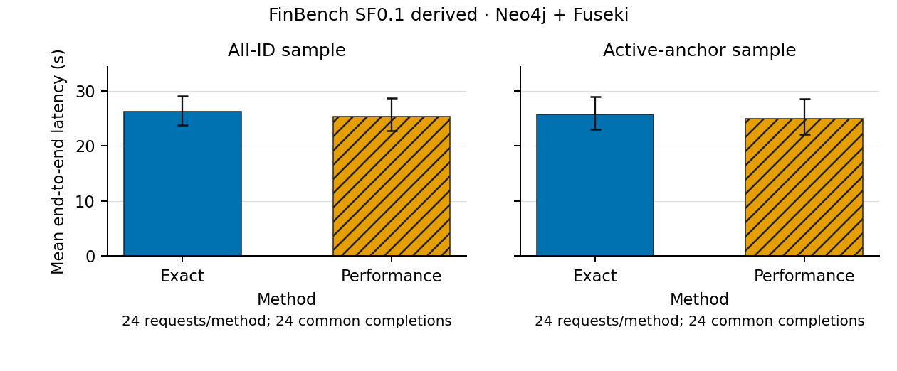

# FinBench 正式主比较结果与里程碑收尾

2026-09-21。已完成 **48 个独立锚点请求 × 2 个模式 = 96 次真实端到端执行**。
全部封存，96 次回答均与独立参考严格一致，无执行失败、无重试、无证书违规；
所有实验进程和观测服务已关闭。按用户最新指令，本轮汇报后暂停，等待讨论。
三数据集/E1–E20 总目标没有完成。

## 实际测了什么

FinBench SF0.1 衍生图，真实 Qwen `qwen3.8-27b` → 受限 NL 候选构造 → 模拟用户 →
共享策略/物理规划 → Neo4j + Fuseki → 物化结果。计时包含本次请求的 worker 初始化、
模型、规划、澄清和执行；源服务启动、离线装载/索引、参考计算和事后评分分开。
这是三个模板结构内的 NL 实验，不是任意自然语言或官方 FinBench 成绩。

按[预先冻结协议](../decisions/chapter7_finbench_primary_freeze_20260921.md)：
全 ID 框和活跃锚点框分别 24 题；每框包含时序可达、出账汇总、公司收款汇总各8题。
本次两个框没有重叠，48个独立 family；开发锚点与正式锚点隔离，但模板并未留出。
每题每模式仅一次，不把96次执行当作96个独立问题，也不声称已测同题重复方差。
Performance ε=1/2，16个候选，四个未确认坐标，权重2/2/1/1固定；方法顺序平衡交错。

## 分层结果

|取样框|Exact 平均端到端|Performance 平均端到端|Exact 正确/回答|Performance 正确/回答|非空参考题数|
|---|---:|---:|---:|---:|---:|
|全 ID 均匀|26.314 s|25.390 s|24/24|24/24|7/24|
|活跃锚点|25.775 s|25.014 s|24/24|24/24|4/24|

所有方法的回答覆盖率和本批严格正确完成率均为100%，answer F1均为1。
每个24题单元的二元正确率 Wilson 95% 区间为 **86.2%–100%**，不能把有限样本100%
当作总体正确率保证。全 ID 17/24空参考，活跃框20/24空参考；非空题共11个，均答对。
活跃资格只依据原图相关边，不能保证通过时间和属性约束后仍有答案。

耗时采用两方法共同完成的24对/框，按 family 做2000次配对重采样。
Performance−Exact 的平均差值及95%区间：

- 全 ID：**−0.924 s，区间 [−2.988, +1.192] s**。
- 活跃锚点：**−0.761 s，区间 [−3.588, +2.108] s**。

两个区间都跨零。点估计低约3.5%/3.0%，本轮**不能声称 Performance 有可靠的提速**。
这些区间针对现有锚点总体及固定模板；没有跨新模板泛化结论。

|实际工作量（每题）|Exact|Performance|
|---|---:|---:|
|模型请求|1|1|
|范围包含确认|1|1|
|随后澄清|1|1|
|澄清披露坐标|4|4|
|后端调用均值|6.333|6.333|
|额外 statistics/probe 调用|0|0|
|全 ID 平均后端传输|30.957 MiB|30.957 MiB|
|活跃框平均后端传输|32.012 MiB|32.012 MiB|
|扩展状态|89|89|
|物理候选准备|16|16|
|最终联邦计划执行|1|1|
|最大实测 query loss|0|0|

全批实际模型调用96次，输入335,704 tokens、输出41,414 tokens；两模式没有token节省。
规划均值约1.29–1.31 s，证书计算约3.3 ms，后端执行约11.75–12.13 s。
最大观测 worker RSS约456.2 MiB，源进程合计峰值约1.188 GiB；未触发预算。
根 gap 未提供数值，保留缺失，不能据此宣称全局或限定搜索空间最优。
原始包（含分析/首版图）约1.34 GiB；重绘和发布副本单独保留。

## 结果告诉了我们什么

**真实主链路已能够稳定完成这份冻结工作负载。** 独立CSV参考、顺序/重复/数值规范、
私有用户隔离、逐题证据、调用计量、预算及服务关闭都已走通。

**当前默认配置没有产生模式间的信息获取 trade-off。** 96条实际轨迹都选择一次披露
全部四个坐标，最后只剩一个意图；Performance 的终止上界和实测 loss 都为0。
这不是“ε保证了所有答案正确”的证据，而是本次没有使用非零损失空间。

实现/配置给出一个直接解释：默认动作只有“问全部”及四种单坐标询问，没有额外子集组合。
声明的信息成本为 `1 + 0.25 × 披露坐标数`，问全部只需2个工作单位；分两次问至少2.5。
在完整16候选笛卡尔族、固定2/2/1/1权重下，只确认任意一个坐标仍不足以满足ε=1/2。
因此默认问全部很便宜。这个解释与已保存轨迹一致；执行反馈的独立作用仍需预定消融验证。
这里是偏好/估计工作单位，不是秒，也没有给模拟用户添加人为延迟。

**活跃锚点资格没有解决空答案主导问题。** 这次活跃框的非空题甚至少于均匀框。
保留该结果，不再按正式答案筛题。下一步如讨论新的任务分布，应先定义符合研究问题的
输入构造并单独冻结，不能替换本批或追加样本直到得到优势。

暂停后优先讨论已有计划中的受控 epsilon/歧义/反馈扫描如何检验“何时能提前停止”，
再执行；不根据本批改价、改动作集后重报同一份主比较。外部同部署比较仍是证据缺口。

## 本轮工程与未完成项

- 新分层分析、区间、图表、公开 metadata 和原版方法接口的11项定向测试通过。
  只测了本轮变更，没有重跑宽泛回归或旧实验。
- 原版 ARUQULA 推理封装、公共 metadata 导出和实际 FedUP 验收脚本已写好。
  [组合接口契约](../decisions/chapter7_aruqula_composition_20260921.md)保留作者原提示、
  搜索和修正流程；跳过其会预读gold并丢弃空答案的评测入口，直接调用原部署API。
  **新组合验收尚未执行**，不是已复现的外部方法成绩；RDF仍为SETUP_ERROR。
- Freebase/FedShop 的当前流水线数据映射、各自pilot/正式运行、真实2/4/8分片、
  同事实RDF外部比较、E3–E6/E9–E20仍未完成。旧组件不冒充新版整体接入。
- 本轮只交付 E1/E2/E7/E8 的 **FinBench原生部署面板**；没有用这些面板代替全部20图。

## 图表与证据



同一目录保存四图的PDF、PNG和逐图CSV：
[E2数据传输](assets/ch7-finbench-primary-20260921/E2_FinBench_native.pdf)、
[E7正确完成率](assets/ch7-finbench-primary-20260921/E7_FinBench_native.pdf)、
[E8回答覆盖率](assets/ch7-finbench-primary-20260921/E8_FinBench_native.pdf)。
图中误差线为95%区间；E1/E2使用family重采样，E7/E8使用上述Wilson区间。
两框分面板；颜色与纹理同时区分方法；已实际渲染检查字号和裁切。

[96行指标](assets/ch7-finbench-primary-20260921/metrics.csv)、
[完整统计及证据索引](assets/ch7-finbench-primary-20260921/summary.json)、
[发布副本校验](assets/ch7-finbench-primary-20260921/publication.json)。

原始根目录：`/Users/anthonyche/xgap-data/ch7-finbench-primary-20260921-v1`。
测量代码：`bc6fdbb5b71823bb3b1cd13c0fc37c51963dc150`；分析/绘图源码与测量版本分开。

|封存材料|SHA-256|
|---|---|
|release/release.json|`b7a7f1cccae657a742a85b2f0c703db45ee6054c300f433f3df68d61fcdbf64a`|
|release/batch.json|`2065f1639b99e6ad8e8e117517f504d4f79269ec96980660f83a5b29eade6e5e`|
|run/invocations/0001/receipt.json|`8730290484f3b6f1ead756e006819b46c7a6385e5532c907ce13cd03a5553585`|
|analysis/summary.json|`5b7b1a6f371eefe3e58fbf8edf965e94ea584390e3392f31ec1bde6a194aecdd`|
|figures-v2/manifest.json|`0628632d05a01703ddf3c4be280fec556f6309a2c15c06ac003614a01f297969`|

无需再调用模型或数据库即可重绘，在仓库根目录使用已配置Matplotlib的Python执行：

```bash
python scripts/render_chapter7_primary.py \
  --summary-path /Users/anthonyche/xgap-data/ch7-finbench-primary-20260921-v1/analysis/summary.json \
  --summary-sha256 5b7b1a6f371eefe3e58fbf8edf965e94ea584390e3392f31ec1bde6a194aecdd \
  --output /absolute/path/to/a/new-figure-directory
```
