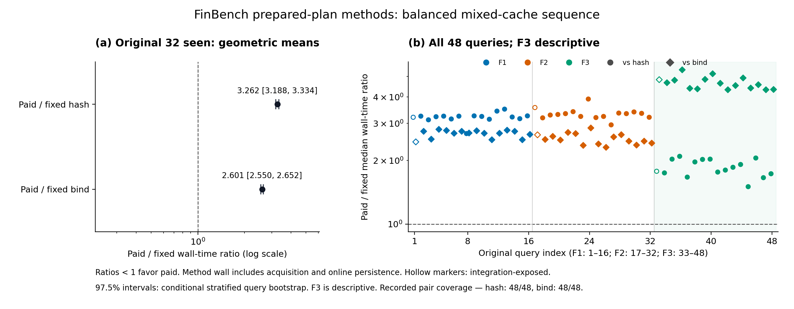

# FinBench 原48题：正确性闭环通过，完整试跑选优未降低总成本

## Material Passport

- Origin Skill: academic-research-suite / experiment-agent
- Mode: existing R-C/E2 protocol execution and sealed-artifact analysis
- Date: 2026-09-12, Asia/Shanghai
- Verification: one actual native campaign; first analysis completed; artifact-only independent audits
- Source revision: parent `9d8cf2ebd79f79f8ea2c78b4bbcf13d94fde7b45` plus recorded file fingerprints
- Protocol: [finbench-paid-balanced-20260912-v1](../decisions/finbench_paid_balanced_v1.md)

**真实 Neo4j + Fuseki 上，原48题 × 六轮 × 三方法全部得到正确的最终答案。**
计入两次完整试跑、选择、重新执行和在线日志后，付费选择的耗时在原32题主分析中为
固定 hash 的 **3.262倍**、固定 bind 的 **2.601倍**。这是已经完成的真实数据实验，
同时也是当前完整试跑策略的负结果，不能作为 XGAP/P1/A3 优于基线的证据。

这是 XGAP 已冻结的 FinBench SF0.1 派生48题工作负载，覆盖三个查询族；不是
FinBench 官方全部查询或排行榜结果。数据、题目、独立答案与原有标签均未重建。

## 问题、处理与可报告结论

既有 R-C/E2 问题是：信息获取带来的执行收益，何时能覆盖获取本身的成本？本轮
X 因素为三种预先准备计划的策略：固定 hash、固定 bind，以及完整执行二者后按
成本选择并重新执行胜者。主要 Y 为包含采集成本的方法 wall time，正确性是前提，
查询调用数、逻辑交换字节和成本分解为辅助指标。

先对每题每方法的六次 wall time 取中位数，再计算题内 paid/fixed 比值的几何均值。
小于1才表示付费选择更快；下表所有比值均大于1。

| 人口与用途 | 配对覆盖 | paid / hash | paid / bind |
|---|---:|---:|---:|
| 原32题，主分析 | 32/32 | 3.262 [3.188, 3.334] | 2.601 [2.550, 2.652] |
| 原16题留出族，仅描述 | 16/16 | 1.846 | 4.650 |
| 预声明30题未接触 seen 子集，仅敏感性描述 | 30/30 | 3.255 | 2.605 |

主分析区间是按 F1/F2 分层、以配对问题为单位的10,000次 bootstrap，种子
2026091212，百分位1.25%/98.75%。每项97.5%区间采用两个比较的 Bonferroni 95%
整体区间约定；其覆盖解释依赖抽样假设，并不提供精确有限样本保证。六轮不是六倍
独立题目；同一图上重叠数据、固定查询族和单一部署限制推广范围。留出族与敏感性
视图不计算该区间，也不替换原32题分母。



可支持的研究结论是：**在此工作负载和部署上，完整试跑两个计划的策略虽能选出
成本较低的观测方案，却无法收回采集成本。** 因而只报告最后一次执行会掩盖真实
代价。下一步对选择性信息获取的检验应保留这个负基线，不围绕正结果改研究问题。
本轮没有证明新的 XGAP 策略更快，也未检验扩展性或模型质量。

## 正确性与成本

完整保留原48题：32 seen-family、16 heldout-family。F1-01、F2-01、F3-01 仍标记
integration-exposed；F3-01 的原 heldout 标签不变，没有任何题被事后改成训练题。

864/864次最终执行、576/576次采集执行均与独立答案 exact 匹配；总计1,440次
计划执行、2,880次查询调用，其中 Neo4j/Fuseki 各1,440次。全部864个方法槽完成，
无失败、未运行或不确定 dispatch；没有模型调用和失败重试。正确的空答案由成功
执行和独立答案共同确认，不把失败空结果当正确。

| 方法（每项288次） | 方法 wall 合计 ms | 查询调用 | 逻辑交换字节 | 调度执行合计 ms | 已计入的在线日志 ms | 方法结束后日志 ms |
|---|---:|---:|---:|---:|---:|---:|
| Fixed hash | 11,443.578 | 576 | 29,523,132 | 9,552.901 | 1,064.218 | 117.809 |
| Fixed bind | 6,573.555 | 576 | 9,226,824 | 5,678.599 | 623.934 | 116.525 |
| Paid selection | 24,396.908 | 1,728 | 48,040,964 | 20,662.319 | 2,320.633 | 120.245 |

这张表是全48题六轮的描述性累计成本，不能替换上面的32题配对估计量。Paid 的
采集部分已花费1,152次调用、38,749,956逻辑字节和15,672.084ms调度执行时间；
再加胜者的新执行及在线记账才是总成本。字节是 runtime 逻辑交换，并非网络抓包
或 HTTP 流量。调度时间按完整计划计，不累加并行节点时间冒充 wall time。

选择只读取两次采集的 latency、bytes 和确定性策略次序。F1 的96次选择中92次
为 hash、4次为 bind；F2 全96次为 hash；F3 全96次为 bound aggregate。
F3 固定 bind 的累计逻辑字节为3,200,856，固定 hash 为23,432,256，但 paid 必须
支付二者采集和新的最终执行，总计29,833,968字节。这说明计划差异存在，也说明
选择一个好的最终计划不自动等于较低总成本。

另一个待检验推论是：当前观测有明显的查询族规律，F1/F2倾向hash，F3倾向bind。
因此 family-global 是下一轮不能省略的强简单对照；本轮不足以证明实例级 memory
或动态策略优于按族固定路由。任何训练该规则的观测都应有独立来源、曝光标记与
真实获取成本。应先检查是否存在足够的题内条件变化和计划成本交叉，再决定哪些
策略工程能检验研究贡献；不能只扩大同质题目数量来制造更窄区间。

纯选择算法为 O(K)，本轮 K=2；黑盒计划执行另外计费。已有条件性2η界仅在统一
预测误差假设下限制下一次执行的选择损失，不约束采集加执行的总成本。本轮没有
验证该误差假设，也没有得到总成本近似比。详见[原选择协议](../decisions/finbench_paid_selection_pilot_v1.md)。

## 工程修复、运行条件与范围

上轮[三题 pilot](finbench_paid_pilot_20260912.md)发现每次进度更新重写累计完整
结果，干扰计时。本轮每个 action 原始结果仅同步保存一次，每个选择单独保存，
进度日志只追加变化的索引。选择必须先持久化，再发起新的最终执行。在线日志的
索引、序列化、hash、写入与 fsync 时间单独测量，但仍包含在方法 wall 中。
客户端原始跟踪仍包含在调度调用成本中；日志列不是全部磁盘 IO。

每轮方法执行后另行封存完整台账，六轮合计13,813.775ms、540,225,777字节，
不计入单次方法 wall，明确保留在整体实验耗时中。初末回调与初始化也单独保存。
没有事后扣除估计开销来修正旧 pilot；旧结果保持原样。

在一台 Apple M2 Pro / 16GiB / 10核 macOS26.5.1 arm64 机器上，一次启动
Neo4j5.26.30 与 Fuseki5.6.0，Java21.0.10。完整18表分区包含365,181源行，
一次加载194个 Neo4j 批次和一个 Fuseki RDF 操作。96个候选计划只编译一次，
共享编译474.075ms、整体准备0.821s、启动/装载20.686s，均单独报告。

原生过程总耗时95.585s（外层收据95.863s），采样峰值合计 RSS 为1,994,407,936
字节，低于6GiB限额；800s工作加100s清理预算未耗尽。两个拥有的服务均正常停止，
独立进程检查确认 PID73063/PID73129 不存在，仅本次临时数据库状态被清理。

六轮中每题覆盖三方法的全部六个排列，每个 paid 位置都有相反的采集顺序，题序
预先固定。数据库在方法、题目和轮次之间保留不断变化的缓存，没有预热查询或
缓存清空。这是受限的 mixed-cache 比较，不是独立冷缓存或稳定热缓存测试。
heldout 是查询族标签，并非缓存温度或记忆迁移证据。

本轮使用预备物理计划，**没有运行普通 P1/A3 策略选择、LLM、memory transfer 或
scalability 实验**。Hash/bind 的 DAG 不同，不能伪装成 P1 的等价 source replicas。
运行记录的 `paper_result=false` 保持不变，表示它不是完整论文方法的最终验收；
上述范围明确的真实观测与负基线仍可报告。

## 验证与复现材料

12项新增日志、failure-accounting、六轮顺序和受影响 tiny coordinator 检查首次
全部通过，pytest0.66s；未重跑旧成功门禁或广泛回归。真实运行仅一次。独立只读
审计102/102项通过，检查顺序、成本、封存、源快照和清理，不重新执行查询或读 gold。
362个源文件/输入的运行前后指纹一致。封存后只解析独立答案一次。

分析首次用7.540s完成，检查1,752个输入产物的身份、原始结果与封存记录的对应、
完整分母和成本后生成 JSON/CSV。它读取已保存的独立评价，不重新打开 oracle。
另一次独立统计核查从六份 sealed core 重算144个题/方法中位数及两个主点估计；
14项数值检查通过后，审计辅助代码在提取 tuple 常量时失败，该失败收据原样保留。
仅补充静态检查，8/8通过，核对 bootstrap 单位/分层/百分位实现；未再读六份原始
记录，也未重跑 bootstrap 或数据库。区间数值没有第二次独立重算。这里的审计
是记录一致性证据，不能把 hash 本身说成时间隔离证明，也不是另一轮复现实验。

- [冻结执行顺序](../../experiments/protocols/finbench_paid_balanced_v1.json)：SHA256 `b6f0d3dcb981b1f2c66a49fb8c601ce73dfec453f2a39911e3ef256d3912380e`
- [机器摘要与完整人口](../../experiments/artifacts/finbench_paid_balanced_20260912.json)
- [逐题六轮与成本 CSV](../../experiments/artifacts/finbench_paid_balanced_20260912/per_query.csv)
- [矢量图](../../experiments/artifacts/finbench_paid_balanced_20260912/paid_cost.svg)
- Raw root: `/Users/anthonyche/xgap-data/e2-finbench-balanced-20260912/`
- Actual execution command: `native_intent.json`; sealed data: `native-run/`
- Analysis: `analysis/analysis.json`, `analysis_receipt.json`; independent checks: `independent_audit.json`, `statistical_crosscheck.json`, `statistical_crosscheck_static_completion.json`

从封存记录重新分析无需数据库或模型：

```bash
python scripts/analyze_finbench_paid_balanced.py --input /Users/anthonyche/xgap-data/e2-finbench-balanced-20260912/native-run --output /path/to/new-analysis-directory
python scripts/plot_finbench_paid_balanced.py --analysis /path/to/new-analysis-directory/analysis.json --output /path/to/new-figure-directory
```

**用户要求本轮后暂停并先讨论；现有自动续跑已暂停，以下仅为待讨论建议。**
下一有限工程门槛是把真实策略空间和实际获取/先验成本接入现有 P1/A3，先在小图
验证身份、硬约束、选择和计费，再按既有实验计划冻结新的真实比较。不能将本轮
48题的结果悄悄用作免费训练 prior；对后续用途必须明确曝光和成本。原五题模型
LINK 仍为3/5，GrailQA 原150题仍未完成真实评价，E1–E5和完整系统论文证据尚未齐备。
